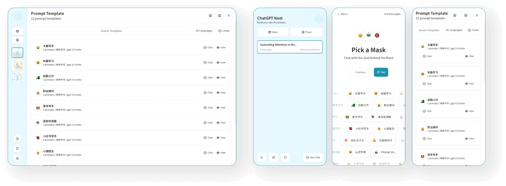

<div align="center">


<h1 align="center">ChatGPT Next Web</h1>

One-Click to get well-designed cross-platform ChatGPT web UI.


[Web App](https://chatgpt.nextweb.fun/) / [Discord](https://discord.gg/YCkeafCafC) / [Twitter](https://twitter.com/mortiest_ricky) / [Buy Me a Coffee](https://www.buymeacoffee.com/yidadaa)

[web-url]: https://chatgpt.nextweb.fun
[Web-image]: https://img.shields.io/badge/Web-PWA-orange?logo=microsoftedge
[Windows-image]: https://img.shields.io/badge/-Windows-blue?logo=windows
[MacOS-image]: https://img.shields.io/badge/-MacOS-black?logo=apple
[Linux-image]: https://img.shields.io/badge/-Linux-333?logo=ubuntu


</div>

## Features

## What's New

- 🚀 v2.0 is released, now you can create prompt templates, turn your ideas into reality! Read this: [ChatGPT Prompt Engineering Tips: Zero, One and Few Shot Prompting](https://www.allabtai.com/prompt-engineering-tips-zero-one-and-few-shot-prompting/).
- 🚀 v2.7 let's share conversations as image, or share to ShareGPT!
- 🚀 v2.8 now we have a client that runs across all platforms!

## Keep Updated

If you have deployed your own project with just one click following the steps above, you may encounter the issue of "Updates Available" constantly showing up. This is because Vercel will create a new project for you by default instead of forking this project, resulting in the inability to detect updates correctly.

We recommend that you follow the steps below to re-deploy:

- Delete the original repository;
- Use the fork button in the upper right corner of the page to fork this project;
- Choose and deploy in Vercel again, [please see the detailed tutorial](./docs/vercel-cn.md).

### Enable Automatic Updates

> If you encounter a failure of Upstream Sync execution, please manually sync fork once.

After forking the project, due to the limitations imposed by GitHub, you need to manually enable Workflows and Upstream Sync Action on the Actions page of the forked project. Once enabled, automatic updates will be scheduled every hour:

### Manually Updating Code

If you want to update instantly, you can check out the [GitHub documentation](https://docs.github.com/en/pull-requests/collaborating-with-pull-requests/working-with-forks/syncing-a-fork) to learn how to synchronize a forked project with upstream code.

You can star or watch this project or follow author to get release notifications in time.

## Access Password

This project provides limited access control. Please add an environment variable named `CODE` on the vercel environment variables page. The value should be passwords separated by comma like this:

```
code1,code2,code3
```

After adding or modifying this environment variable, please redeploy the project for the changes to take effect.

## Environment Variables


### `OPENAI_API_KEY` (required)

Your openai api key.

### `CODE` (optional)

Access password, separated by comma.

### `BASE_URL` (optional)

> Default: `https://api.openai.com`

> Examples: `http://your-openai-proxy.com`

Override openai api request base url.

### `OPENAI_ORG_ID` (optional)

Specify OpenAI organization ID.

### `HIDE_USER_API_KEY` (optional)

> Default: Empty

If you do not want users to input their own API key, set this value to 1.

### `DISABLE_GPT4` (optional)

> Default: Empty

If you do not want users to use GPT-4, set this value to 1.

### `HIDE_BALANCE_QUERY` (optional)

> Default: Empty

If you do not want users to query balance, set this value to 1.

## Requirements

NodeJS >= 18

## Development


Before starting development, you must create a new `.env.local` file at project root, and place your api key into it:

```
OPENAI_API_KEY=<your api key here>

# if you are not able to access openai service, use this BASE_URL
BASE_URL=https://chatgpt1.nextweb.fun/api/proxy
```

### Local Development

```shell
# 1. install nodejs and yarn first
# 2. config local env vars in `.env.local`
# 3. run
yarn install
yarn dev
```
## Screenshots




## Translation

If you want to add a new translation, read this [document](./docs/translation.md).

## Special Thanks

## LICENSE

[MIT](https://opensource.org/license/mit/)
